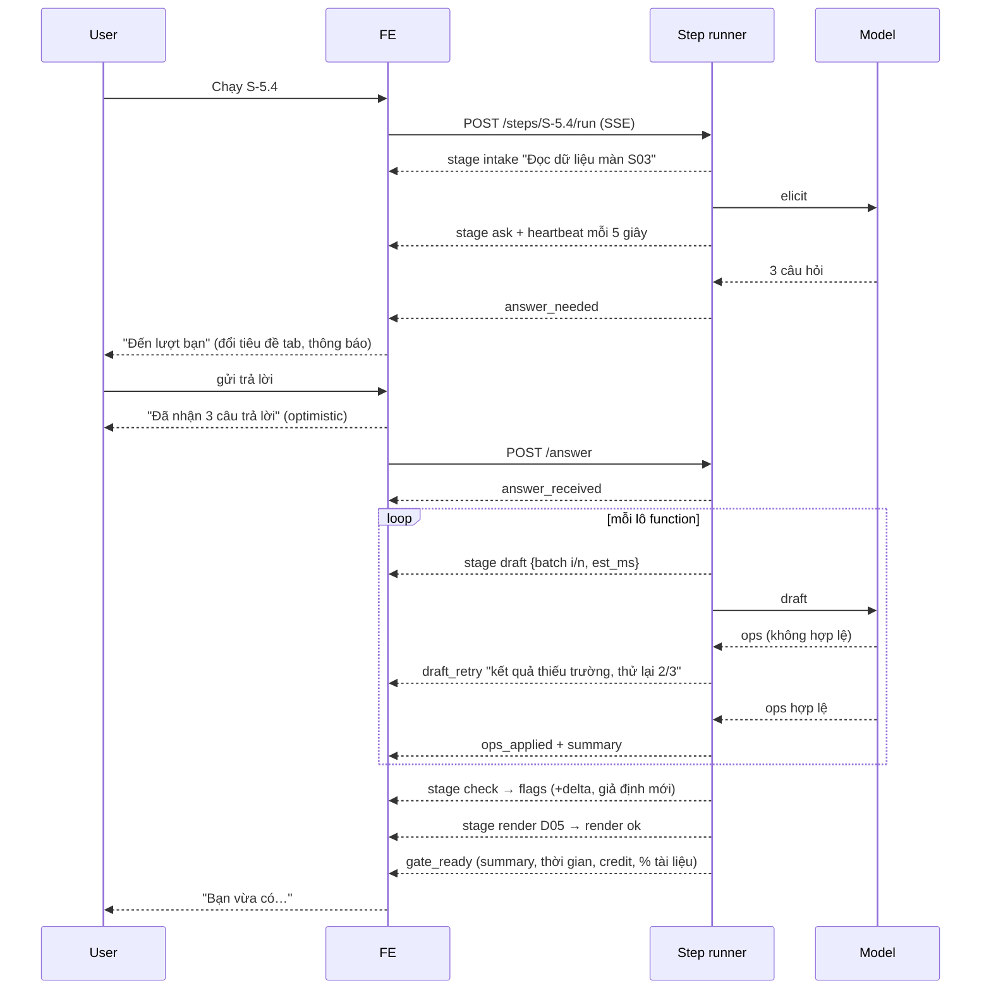

# 03 — Luồng hiển thị: FlintFlow đang làm gì, còn bao lâu, user được gì

**Vấn đề.** Mỗi step phải chờ khoảng 30 giây đến 2 phút, có lúc bị treo 20 phút. Trong thời gian đó user chỉ thấy một dòng như "Đang soạn (lượt 1)". User không biết:
- mình đang ở đâu trong cả quy trình;
- AI đang làm gì;
- còn phải chờ bao lâu, hay hệ thống đã treo;
- chờ xong thì được gì.

Họ cũng không dám rời máy vì không biết khi nào đến lượt mình.

**Mục tiêu.** Ở mọi thời điểm, màn hình trả lời được 4 câu:

| # | Câu hỏi của user | Lớp UI trả lời |
|---|---|---|
| 1 | Tôi đang ở đâu, còn bao xa? | Lớp 1: Bản đồ hành trình |
| 2 | Bước này để làm gì, tôi sẽ được gì? | Lớp 2: Thẻ "Bước này sẽ…" |
| 3 | Đang làm gì, còn bao lâu, có bị treo không, tôi có cần làm gì không? | Lớp 3: Tiến trình trực tiếp |
| 4 | Xong rồi, tôi được gì? | Lớp 4: "Bạn vừa có" |
| (+) | Tôi có thể đi làm việc khác không? | Lớp 5: Chạy nền và thông báo |

**Nguyên tắc: không bịa tiến độ.** Không dùng thanh % giả chạy theo thời gian. Mọi thông tin hiển thị phải lấy từ tín hiệu thật mà runner đang có: stage, lô function, attempt, hình đang vẽ, số op, cờ. Ước lượng thời gian phải ghi rõ là ước lượng ("thường mất khoảng 1 phút").

---

## 1. Hiện trạng trong code

- **BE** phát SSE (`BE/modules/pipeline/pipeline.dto.ts` `stepEventSchema`) với các event:
  - `intake` (chỉ khi đổi phase)
  - `elicit`
  - `answer_needed`
  - `draft {attempt}`
  - `ops_applied {changes}`
  - `render {diagram_id, status}`
  - `flags {red, yellow}`
  - `gate_ready`
  - `error`
- **FE** `StepEventLog.tsx` in mỗi event thành một dòng, và **ẩn `elicit`**. `useStepRunner.ts` đổi `status` theo event.
- **Khoảng trống:**
  - Không có event nào trong **lúc model đang soạn**. Một lời gọi draft có thể mất 30–90 giây mà không phát gì.
  - Sau khi user gửi câu trả lời, không có event nào cho tới lượt draft (BUG-32).
  - Không có thông tin về mục đích của step, không có thời gian dự kiến, không có heartbeat.
  - `ops_applied.changes` chỉ được đếm số lượng, không hiện nội dung.
  - Không có trạng thái "chờ lâu bất thường" hay nút huỷ.
  - Reload thì mất hết (BUG-07).

## 2. Năm lớp UI

### Lớp 1 · Bản đồ hành trình (luôn hiện, đầu trang)

```
┌───────────────────────────────────────────────────────────────────────────────┐
│ Minh An Booking                                     Tài liệu: 46% · 118 credit │
│ ●━━━●━━━●━━━●━━━●━━━◉━━━○━━━○━━━○                                               │
│ Ý tưởng Brief Phân tích Tổng quan UseCase [Màn hình 3/7] NFR Ghép Kiểm&Ký       │
│ Đang ở: Chi tiết màn · Màn S03 "Book Appointment" · còn khoảng 6 điểm duyệt     │
└───────────────────────────────────────────────────────────────────────────────┘
```

- Mỗi chấm là một phase. Đang ở phase S-5 thì hiện thêm "Màn 3/7".
- **"Còn khoảng N điểm duyệt"** chỉ đếm các gate thật sự còn lại, theo chế độ duyệt ở file 02 R5. Không đếm 91 step.
- **Tài liệu %** lấy từ `pipeline-progress.ts` (số section đã có nội dung trên tổng số). Đây là "đã được gì" ở mức toàn cục.

### Lớp 2 · Thẻ "Bước này sẽ…" (trước khi chạy, và thu gọn khi đang chạy)

```
┌ S-4.3 · Phân quyền màn hình ──────────────────────────────────────────┐
│ Bước này sẽ: lập ma trận ai được xem/tạo/sửa/xoá trên từng màn.        │
│ Dùng từ trước: 7 màn (S-4.1), 4 vai trò (S-3.1).                       │
│ Bạn có thể được hỏi: 1–2 câu về quyền của Admin.                       │
│ Thường mất: khoảng 1 phút · khoảng 4 credit                            │
│                                             [ Chạy bước này ]          │
└────────────────────────────────────────────────────────────────────────┘
```

- **Dữ liệu:** thêm vào `assets/step-registry.json` các trường sau cho mỗi step:
  - `purpose_vi`: bước này làm gì;
  - `produces_vi`: tạo ra gì trong tài liệu;
  - `inputs_from`: danh sách step nguồn.

  Hai trường **`est_duration_s` và `est_credit`** tính từ lịch sử thật, xem mục 6.
- "Dùng từ trước" giúp user hiểu vì sao các bước trước cần chính xác, và nếu kết quả sai thì biết nên quay lại bước nào.

### Lớp 3 · Tiến trình trực tiếp (khi đang chạy)

```
┌ S-5.4 · Chi tiết chức năng · Màn S03 ─────────────────── 00:47 ──────┐
│ ✓ Đọc dữ liệu màn S03 (6 function, 3 quy tắc liên quan)               │
│ ✓ Hỏi bạn 3 câu · đã nhận trả lời lúc 14:02                           │
│ ◉ AI đang soạn chi tiết function · lô 1/2 (FN010–FN015)                │
│   thường mất khoảng 40 giây mỗi lô                                     │
│ ○ Kiểm tra quy tắc & tham chiếu                                        │
│ ○ Vẽ lại hình D05                                                      │
│ ○ Chờ bạn duyệt                                                        │
│                                                                        │
│ Vừa ghi: + FN010 validation "Không cho đặt trùng giờ" · + MSG012 …     │
│                                          [ Chạy nền ]  [ Huỷ lượt ]    │
└────────────────────────────────────────────────────────────────────────┘
```

- **Stepper theo stage**: Đọc → Hỏi → Soạn → Kiểm tra → Vẽ → Duyệt. Chỉ hiện các stage mà step này thật sự có, lấy từ spec: `needsDraft`, `renders`, `deterministic`.
- **Đồng hồ đã chạy**, và dòng "thường mất khoảng X".
- **Dòng phụ cụ thể** cho stage đang chạy, lấy từ tín hiệu thật:
  - lô function (`functionBatches`);
  - `attempt` của draft;
  - `diagram_id` đang vẽ.
- **"Vừa ghi"**: ngay khi có `ops_applied`, hiện các dòng tóm tắt (dùng chung bộ sinh `summary` với WP-5). User thấy tài liệu đang lớn dần, thay vì chỉ thấy một con số.
- **Khi AI phải thử lại**, dùng lời thường: "AI trả kết quả thiếu dữ liệu, đang thử lại (lần 2/3)". Không hiện mã lỗi.
- **Đang chờ user trả lời** thì stepper dừng ở "Hỏi", có badge **"Đến lượt bạn"**, form câu hỏi được đưa lên đầu, và tab trình duyệt nhấp nháy tiêu đề "(1) Đến lượt bạn — FlintFlow".

### Lớp 4 · "Bạn vừa có" (tại gate)

```
┌ Xong S-4.3 · Phân quyền màn hình ──────────────────── 58 giây · 4 credit ┐
│ Bạn vừa có:                                                             │
│  • Ma trận quyền 7 màn × 4 vai trò          [xem bảng ▾]                │
│  • Sửa: Admin được Tạo/Xoá trên "Manage Staff"                          │
│ Cần bạn xem: 1 giả định mới                                             │
│  • AS12 "Lễ tân không được xoá lịch hẹn"   [Đúng] [Sửa] [Bỏ]             │
│ Kiểm tra: cờ đỏ 3 → 2 (−1) · cờ vàng 5 → 5                              │
│ Tài liệu: 44% → 46% · mục 3.x Authorization đã có nội dung               │
│                         [ Accept ]  [ Yêu cầu sửa ]  [ Soạn lại ]         │
└─────────────────────────────────────────────────────────────────────────┘
```

- Lớp này chính là WP-5 trong file 01, cộng thêm **chênh lệch** cờ và % tài liệu (trước → sau), thời gian và credit thật của step.
- **Step 0 op** thì ghi rõ "Bước này không thay đổi tài liệu, vì <lý do>".
  - Nếu step được tự Accept (file 02 R1), thẻ thu nhỏ thành một dòng trong nhật ký: "✓ S-5.3 tự hoàn tất: không có gì cần duyệt".
  - Nếu **user đã yêu cầu sửa mà kết quả là 0 op**, hiện cảnh báo vàng: "Không ghi được thay đổi nào theo yêu cầu của bạn", kèm nút "Thử bằng công cụ sửa".

### Lớp 5 · Chạy nền và thông báo

- Nút **"Chạy nền"** thu Lớp 3 thành một pill ở góc: "S-5.4 · đang soạn lô 1/2 · 00:47". User đi xem tài liệu hoặc sang tab khác vẫn được.
- Khi **cần user** (có câu hỏi, gate sẵn sàng, lỗi), hệ thống báo bằng:
  - toast trong app;
  - đổi tiêu đề tab;
  - Browser Notification, nếu user cho phép;
  - chuông in-app, nối vào module `notification` đã có ở BE.
- Khi chạy chuỗi phase (file 02 R2), pill hiện "Phase NFR · bước 3/9 · chưa cần bạn". User **biết chắc là chưa cần mình** nên có thể yên tâm rời máy.

## 3. Hành vi theo thời gian chờ

Đây là quy tắc chống cảm giác bị treo:

| Thời gian kể từ event cuối | Hiển thị |
|---|---|
| 0–1 giây sau thao tác của user | Phản hồi **ngay**. Bấm Chạy → "Đang khởi động…". Gửi trả lời → "Đã nhận 3 câu trả lời" (sửa BUG-32, không chờ BE) |
| đến khoảng 1,5 lần `est_duration` của stage | Bình thường: stepper, đồng hồ, dòng phụ |
| quá 1,5 lần ước lượng, heartbeat vẫn đến | "AI phản hồi chậm hơn thường lệ, vẫn đang chạy." Nút **Huỷ lượt** nổi lên |
| không có heartbeat 30 giây | "Mất kết nối với lượt chạy, đang kết nối lại…". FE gọi `GET run-state`: nếu BE còn chạy thì nối lại stream, nếu đã chết thì chuyển sang dòng dưới |
| lượt chạy đã chết | "Lượt chạy bị gián đoạn. Nội dung đã ghi trước đó được giữ." Hai nút: [Chạy lại bước] [Xem phần đã ghi] |
| lỗi | Thông điệp theo bảng WP-8, và luôn có một hành động kế tiếp. Không bao giờ chỉ có nút "Đóng" |

## 4. Máy trạng thái (FE `useStepRunner`)

```mermaid
stateDiagram-v2
  [*] --> idle
  idle --> starting: bấm Chạy
  starting --> reading: stage=intake
  reading --> asking: answer_needed
  asking --> answered: user gửi (optimistic)
  answered --> drafting: answer_received / stage=draft
  reading --> drafting: stage=draft
  drafting --> drafting: draft_retry / batch kế
  drafting --> checking: stage=check
  checking --> rendering: stage=render
  rendering --> gate: gate_ready
  checking --> gate: gate_ready
  gate --> autoAccepted: auto_accepted
  autoAccepted --> starting: chuỗi phase chạy step kế
  gate --> idle: Accept
  gate --> starting: Revision / Regenerate
  drafting --> slow: quá 1,5× ước lượng
  slow --> drafting: event mới
  drafting --> reconnecting: không có heartbeat 30 giây
  asking --> reconnecting: SSE đóng
  reconnecting --> drafting: run-state còn chạy
  reconnecting --> asking: run-state có câu hỏi
  reconnecting --> gate: run-state có gate
  reconnecting --> interrupted: run-state chết
  interrupted --> starting: Chạy lại
  drafting --> error: error
  error --> starting: Thử lại
```



## 5. Hợp đồng SSE mới (BE)

Chỉ **thêm** event và thêm trường, không đổi event cũ, để FE cũ vẫn chạy được.

| Event | Trường | Phát khi nào |
|---|---|---|
| `stage` | `stage: "intake"\|"ask"\|"draft"\|"check"\|"render"\|"gate"`, `label_vi`, `detail_vi?`, `batch?: {i, n}`, `est_ms?` | Mỗi lần runner chuyển stage hoặc lô. Thay cho `intake` vốn chỉ phát khi đổi phase |
| `heartbeat` | `elapsed_ms`, `stage` | Mỗi 5 giây khi đang chờ model hoặc chờ render |
| `answer_received` | `count` | Ngay sau `waitForAnswer` resolve |
| `draft_retry` | `attempt`, `max`, `reason_vi` | Khi `runDraftPhase` thử lại. `reason_vi` là lời thường, ví dụ "kết quả thiếu trường", "vi phạm quy tắc tham chiếu" |
| `ops_applied` (mở rộng) | thêm `summary: {kind:"add"\|"update"\|"remove", collection, id, title_vi}[]` | Như cũ |
| `flags` (mở rộng) | thêm `red_delta`, `yellow_delta`, `new_assumptions: {id, text}[]` | Như cũ |
| `gate_ready` (mở rộng) | thêm `summary` (gom theo collection), `duration_ms`, `credits_used`, `doc_progress: {before, after}`, `no_change_reason?` | Như cũ |
| `auto_accepted` | `step_id`, `reason_vi` | File 02 R1 |
| `phase_progress` | `phase`, `step_index`, `step_total`, `needs_user: boolean` | Mỗi step trong chuỗi phase (file 02 R2) |

**Nơi phát event** trong `BE/modules/pipeline/step-runner.service.ts`:
- `stage=intake` sau `buildStepContext`;
- `stage=ask` trước lời gọi `elicitExecutor`;
- `answer_received` sau `waitForAnswer`;
- `stage=draft` kèm `batch` ở mỗi vòng `for (const batch of functionBatches(...))`;
- `stage=check` ở đầu `runRenderReviewPhase` trước deterministic-check;
- `stage=render` cho mỗi `renders[i]`.

**Heartbeat** dùng một `setInterval` bọc quanh các lời gọi model hoặc render đang chờ, và bị dọn trong `finally`.

**Run-state lưu ở BE** (dùng chung với WP-4 BUG-05 và BUG-07). Mỗi event đồng thời cập nhật một document:

```
step_runs: {
  project_id,
  step_id,
  run_id,
  stage,
  detail_vi,
  started_at,
  last_event_at,
  locked_until,
  questions?,
  gate_payload?,
  status: "running"|"waiting_answer"|"gate"|"done"|"interrupted"|"cancelled"
}
```

Endpoint:
- `GET /projects/:id/steps/:stepId/run-state` trả document này, để khôi phục sau reload hoặc mất mạng;
- `POST /projects/:id/steps/:stepId/cancel` huỷ lượt (abort model và nhả khoá);
- `GET /projects/:id/run-state/active` trả lượt đang chạy của dự án, để pill ở Lớp 5 khôi phục được khi user mở lại trang.



## 6. Ước lượng thời gian và credit (`est_duration_s`, `est_credit`)

- **Nguồn:** `meter.service.ts` đã ghi usage cho mỗi lời gọi (`call_kind`, token, cost). Thêm `duration_ms` vào bản ghi.
- **Cách tính:** lấy median của N lần chạy gần nhất theo `step base id` (ví dụ `S-5.4`) và `call_kind`, trên mọi dự án. Chưa đủ 5 mẫu thì dùng giá trị mặc định trong registry.
- **Hiển thị:** "khoảng 1 phút" và "khoảng 4 credit". Làm tròn thô để không tạo cảm giác hứa hẹn chính xác.

## 7. Quy tắc viết lời hiển thị

- Tiếng Việt, câu thường. **Không** hiện mã (`STEP_NOT_RUNNABLE`, `@loop`, `op`, `spine`, `projection`). Mã chỉ nằm trong phần "Chi tiết" thu gọn.
- Nói **cái gì** thay vì **quy trình nội bộ**. Viết "Đang soạn chi tiết 6 chức năng của màn Đặt lịch", không viết "Draft attempt 1".
- Mọi trạng thái chờ phải có **đối tượng** (đang chờ ai hoặc cái gì) và **hành động kế tiếp** (bạn có thể làm gì).
- Không đổ lỗi sai: bỏ câu "another session".

## 8. Tiêu chí xong

- Trong mọi lượt chạy, **không có khoảng nào quá 5 giây mà UI không đổi** (đồng hồ hoặc heartbeat). Kiểm bằng e2e với provider giả chạy chậm.
- Sau khi gửi trả lời, trạng thái đổi trong **dưới 300 ms**.
- Reload ở bất kỳ stage nào đều khôi phục đúng Lớp 3 hoặc Lớp 4 mà **không tốn credit**.
- Giả lập model treo: sau 1,5 lần ước lượng thì hiện "chậm hơn thường lệ" kèm nút Huỷ. Bấm Huỷ thì khoá được nhả **dưới 2 giây**.
- Gate của mọi step có Lớp 4. Step 0 op có lý do.
- Người test mới (không biết code) trả lời đúng 4 câu hỏi ở đầu file khi nhìn bất kỳ ảnh chụp nào trong lúc chạy.

## 9. Chia đợt

| Đợt | Việc | Sửa luôn lỗi |
|---|---|---|
| P1 (S2, làm cùng WP-4/WP-5) | Event `stage`, `heartbeat`, `answer_received`, `draft_retry`; run-state và `cancel`; Lớp 3 với stepper, đồng hồ, trạng thái chậm và mất kết nối; Lớp 4 dùng `summary` | BUG-05, 07, 25, 32 và phần hiển thị của BUG-13 |
| P2 (S3) | Lớp 1 bản đồ hành trình; Lớp 2 thẻ "Bước này sẽ…" (thêm trường registry và ước lượng từ meter) | |
| P3 (S3–S4, đi cùng file 02 R2) | Lớp 5 chạy nền và thông báo; `auto_accepted`, `phase_progress`; pill và khôi phục qua `run-state/active` | |

**File chính:**
- BE: `modules/pipeline/pipeline.dto.ts`, `step-runner.service.ts`, `pipeline.controller.ts` (heartbeat, cancel), `pipeline.route.ts`, `meter.service.ts` (`duration_ms`), `assets/step-registry.json`, và một collection `step_runs` mới.
- FE: `app/projects/[id]/hooks/useStepRunner.ts` (máy trạng thái mới), `_components/StepEventLog.tsx` (thay bằng `StepProgress`), `_components/GateCard.tsx` (Lớp 4), `types/pipeline.ts`, `lib/api/pipeline.ts`, cùng các component mới `JourneyBar`, `StepIntroCard` và `RunPill`.
