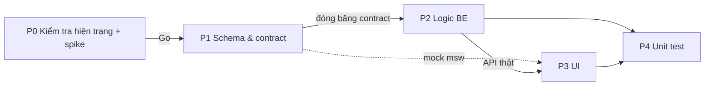

# Plan — Mode 1: Upload SRS có sẵn rồi sửa (Import I-1…I-4 + Change Request C-1…C-7 + Release)

> **Nguồn:** `doc/flintflow-business-flow (1).bpmn` (Flow 1 nút 1.1–1.13, Flow 3 nút 3.1–3.14, Flow 4 credit, Flow 5 LLM failure, Flow 6 release), `doc/flintflow-business-workflow.bpmn` (bản gộp cho người đọc nghiệp vụ), `doc/actors-and-use-cases.md` (UC-13, UC-19–UC-24, UC-48–UC-57, UC-61, UC-75, UC-81, UC-82, BR-01…BR-04).
> **Khảo sát code:** `flintflow_be` và `flintflow_fe` nhánh `develop` ngày 2026-09-18.
> **Vị trí trong plan tổng:** đây là bản chi tiết của "Wave 6 tuỳ chọn" (`plan-overview.md` §9), chỉ phần import + change request + release cho mode 1. Template khách hàng (mode 3) và vai trò Lead/Analyst/Viewer (E5) **không** nằm trong plan này.
> **Cách chia:** 5 phase chạy lần lượt: **P0 kiểm tra hiện trạng → P1 schema/contract → P2 logic BE → P3 UI → P4 unit test.** Mỗi phase có DoD dạng checkbox; phase sau chỉ mở khi DoD phase trước tick đủ (riêng P3 được làm trên mock khi P1 đã đóng băng contract, xem §3).

## 0. Trạng thái & bàn giao (đọc mục này trước khi làm tiếp — cập nhật mỗi khi đổi phase)

**Cập nhật: 2026-09-19.**

| Phase | Trạng thái | Ở đâu |
|---|---|---|
| P0 | **Xong, Go** (nhóm chốt G1–G9, G3 dùng bookmark ẩn `_ff_<blockId>` làm neo chính) | Báo cáo `reports/mode1-p0-report.md`; mã spike + ảnh `reports/mode1-p0/` |
| P1 | **Xong**, nhóm chốt contract-change 4/4 + đóng băng `import-change-contract.md` | BE PR [#50](https://github.com/mit-suu/flintflow_be/pull/50), FE PR [#29](https://github.com/mit-suu/flintflow_fe/pull/29), nhánh `feat/FLF-171-mode1-p1-schema` (đã push, **chưa merge**) |
| P2 | **Code xong 2A–2G** (BE, 5 nhánh xếp chồng từ nhánh P1 — phương án A); DoD 9/10, còn kiểm LibreOffice | Báo cáo `reports/mode1-p2-report.md`; nhánh `feat/FLF-171-mode1-p2-ooxml` → `-import` → `-extract` → `-change-request` → `-release-guard` (đã push); BE PR [#51](https://github.com/mit-suu/flintflow_be/pull/51) (`-release-guard` → `develop`, gồm cả commit P1 tới khi #50 merge). Việc A (I-4 chạy nền): nhánh `feat/FLF-171-mode1-p2-async-extract`, PR [#52](https://github.com/mit-suu/flintflow_be/pull/52) |
| P3 | **Sắp làm** (người dùng chốt 2026-09-19: làm việc A trước rồi qua P3) | FE trên nhánh P1 `feat/FLF-171-mode1-p1-schema` (PR #29 chưa merge), mock `flintflow_fe/mocks/mode1/`; #6/#10 trả ngay `extracting`, màn 3.5 poll `GET /import` |
| P4 | Chưa | |

**Quy ước đã chốt với người dùng**
- Ticket: **cả mode 1 dùng chung FLF-171**. Commit `flf-171: <việc>` tiếng Việt, **không** thêm trailer `Co-Authored-By`. PR tiêu đề `[FLF-171] …`.
- Mỗi phase/cụm một nhánh riêng (không commit tiếp vào nhánh đã có PR). P2 dự kiến 5 nhánh xếp chồng: `feat/FLF-171-mode1-p2-ooxml` (2A) → `-p2-import` (2B+2D) → `-p2-extract` (2C) → `-p2-change-request` (2E) → `-p2-release-guard` (2F+2G).
- Kiểm tương thích file: máy hiện tại **chỉ có Word 16** (COM qua PowerShell). LibreOffice **không bỏ**, chỉ hoãn — là checkbox trong DoD P2.
- Push/tạo PR: máy không có `gh`; đã tạo PR qua GitHub API bằng credential git. Repo chưa có nhãn `contract-change`.
- Thay đổi trong `claude_plan` (plan này, `reports/`) **chưa commit** — chờ người dùng bảo.

**Bước tiếp theo (chờ người dùng xác nhận)**
1. Review + merge BE #50 (P1) → #51 (P2) → #52 (việc A); FE #29.
2. DoD P2 còn mở: kiểm LibreOffice (máy chưa có); FE P3 nối API thật (contract không đổi).
3. Việc P1 đẩy sang P2 đã làm: `snapshotBaseline` tách khỏi `signOff`; `RuleProfile` (loại/hạ luật) cho `runDeterministicCheck`/`recompute`; `purgeProjectData` dọn collection + file mode 1.
4. Việc A (I-4 chạy nền) **xong** (#52). Còn hoãn **B** giảm credit import ≤ 100 (gộp section nhỏ + trích tất định bảng dọc) — mô tả ở `reports/mode1-p2-report.md` §7.1, không ảnh hưởng FE.
5. Bắt đầu P3: tách nhánh FE `feat/FLF-171-mode1-p3-ui` từ `feat/FLF-171-mode1-p1-schema`; sửa mock #6/#10 theo hành vi chạy nền trước khi làm màn 3.5.
6. `claude_plan`: 2 commit trên nhánh `docs/FLF-171-mode1-p0-p2` chưa push được (repo đổi tên `mit-suu/plan_overview`, `TuanAnh164` không có quyền push) — chờ người dùng chọn cách.

**Phát hiện P0 phải nhớ khi viết P2:** styleId heading bị Word bản địa hoá (`Heading1` → `u1`) ⇒ nhận heading qua `styles.xml`; SRS thật của nhóm không dùng style heading ⇒ cần nhận theo số mục; file do `docx` lib sinh không có `w14:paraId`; output AI trích field phải theo thực thể (chi phí, báo cáo P0 §4.8).

---

## 1. Luồng nghiệp vụ cần làm

```
Tạo project mode 1 (UC-13)
  └─ 1.1 Upload .docx ─► 1.2 Preflight (I-1) ─┬─ bị từ chối ─► sửa file, upload lại
                                              ├─ stamp của project khác ─► từ chối
                                              ├─ stamp của chính project ─► 1.4 Diff theo block (UC-24) ─► (tuỳ) tạo CR nguồn "re-upload"
                                              └─ không stamp ─► 1.3 Xác nhận bản mới nhất
  ─► 1.5 Tách + neo block (I-2) ─► 1.6 Khớp template profile (I-3) ─► [độ tin thấp] 1.7 Xác nhận mapping (UC-21)
  ─► [Flow 4 credit] 1.8 AI trích field Spine (I-4) ─► [độ tin thấp] 1.9 Xác nhận field (UC-22)
  ─► 1.10 Tạo baseline v0 (type imported) ─► [Flow 4] 1.11 AI semantic check (vàng) ─► 1.12 Code-rule check (đỏ/vàng)
  ─► 1.13 Xem gap report (UC-23) ─┬─ không cần sửa ─► giao gap report (kết thúc)
                                  └─ cần sửa ─► Change request
Change request (BR-03: đã có baseline ⇒ mọi sửa phải qua CR)
  3.1 Log CR (C-1, UC-48) ─► [Flow 4] 3.2 AI làm rõ (C-2) ─► [mơ hồ] 3.3 Trả lời (UC-49) ─► quay lại 3.2
  ─► 3.4 Tìm vị trí ảnh hưởng (C-3, UC-50, deterministic) ─► 3.5 Khoá block
  ─► [Flow 4] 3.6 AI đề xuất từng vị trí: edit | comment only | not related + lý do (C-4, UC-81)
  ─► 3.7 Code check (old text khớp, Spine rule) + [Flow 4] 3.8 AI consistency (vàng) (C-5, UC-82)
       └─ trượt ─► AI làm lại (≤ 2 lần) ─► vẫn trượt ─► 3.9 sửa tay ở owner step hoặc 3.10 huỷ CR (UC-53)
  ─► 3.11 Nộp change group (UC-51) ─► 3.12 Duyệt/từ chối từng group (UC-52)
       ├─ tất cả bị từ chối ─► sửa lại CR (khoá lại block, về 3.6) hoặc 3.13 đóng CR
       └─ tất cả/một phần duyệt ─► 3.14 Ghi Track Changes + comment (author = CR ID), bản draft lên minor (0.1, 0.2…), mở khoá block
Release (Flow 6, Lead chủ động, không gắn với một CR)
  6.1 Release ─► [đỏ = 0] 6.2 Đóng dấu major (1.0, 2.0…), khoá baseline, render bản sạch ─► 6.3 Tải về (UC-57)
Flow 4/5 bọc mọi bước AI: giữ credit trước, quyết toán sau, lỗi 2 lần thì hoàn giữ và cho "thử lại / làm sau" (BR-01, UC-61, UC-75).
```

## 2. Giả định chốt để lập plan (phản đối thì sửa ở P0 trước khi mở P1)

| # | Vấn đề | Giả định |
|---|---|---|
| G1 | Chưa có Organization/role (Project chỉ có `userId`; E5 hoãn) | Người tạo project = **Lead** của tổ chức một người ⇒ **tự duyệt** (UC-52 không qua UC-51). Model CR vẫn có `submitted_at`, `decided_by` để khi có E5 chỉ thêm nhánh Analyst → Lead. |
| G2 | Nguồn sự thật của nội dung ở mode 1 | **File .docx gốc + bảng block** là nguồn sự thật của văn bản; Spine chỉ là **chỉ mục trích ra** để check, tìm impact và đưa ngữ cảnh cho AI. Mode 1 **không** render lại tài liệu từ Spine (không dùng `assemble`/`docx-writer` cho bản chính). |
| G3 | Neo block | **Đổi sau P0, nhóm đã chốt 2026-09-18:** neo chính là bookmark ẩn `_ff_<blockId>`, ghi vào bản lưu lúc import. Bookmark giữ 100% qua Word với mọi nguồn file. Neo phụ: `w14:paraId` (nếu có), `text_hash`, vị trí trong cây heading. Không dựa chính vào paraId vì file do docx lib sinh (kể cả file xuất từ FlintFlow mode 2) không có paraId, và Word sinh lại toàn bộ paraId, bỏ paraId tự gán. Xem `reports/mode1-p0-report.md` §4.1. |
| G4 | Đánh số version | Import = `0.0` (baseline v0, type `imported`). Mỗi CR ghi xong = minor tiếp theo của draft (`0.1`, `0.2`…). Release = major tiếp theo (`1.0`, `2.0`…) kèm baseline type `release`. Khác quy ước `v1.N` của mode 2 (`baseline.service.ts:57`) ⇒ tách hàm đánh số theo mode. |
| G5 | Waive cờ | Mode 1 **không** có waive (UC-42 đã bỏ, BR-04). Code hiện còn `flags.service.waive` + baseline `-conditional` cho mode 2 — không đụng trong plan này, ghi vào `docs/spec-gaps.md`. |
| G6 | Gửi gì cho model | Chỉ gửi text của block (theo section), không gửi file — giữ giả định 10 của plan tổng. |
| G7 | Bảng trong file | Bảng có cột khớp đủ field (ví dụ bảng Use Case, bảng NFR) được trích **deterministic**, không tốn credit; AI chỉ trích phần văn xuôi và bảng khớp một phần. |
| G8 | Watermark DRAFT cho bản draft mode 1 | Chèn chữ "DRAFT" vào header của bản tải về (không sửa file lưu). Nếu spike P0 cho thấy header gốc phức tạp (nhiều section/header khác nhau) thì hạ xuống: custom property + tiền tố `DRAFT_` ở tên file. **P0:** giữ nguyên phương án. Shape VML chèn vào mọi header part, tạo header nếu thiếu; chạy đúng trên Word với file nhiều section, header trang đầu riêng, header kế thừa và file không có header. LibreOffice chưa kiểm (hoãn, xem DoD P2). |
| G9 | Chat ở mode 1 | Chat chỉ để hỏi đáp. Lệnh sửa trong chat trả `409 CHANGE_REQUIRES_CR` kèm gợi ý tạo CR điền sẵn (BR-03). |

---

## 3. Tổng quan phase

| Phase | Nội dung | Effort (1 điểm ≈ 0,5 ngày công) | Gợi ý người | Mở khi |
|---|---|---|---|---|
| **P0** | Kiểm tra hiện trạng: chạy lại toàn bộ test, kiểm các khối tái dùng, spike OOXML (Track Changes, paraId, comment, stamp), đo token | 5 | A + C (spike), B (đo token), D (FE test) | ngay |
| **P1** | Define schema: model Mongo, zod DTO, contract API, ActionType + skill khung, types FE, contract-change `baselineSchema.type` | 7 | A (CR), C (import/version), B (AI output schema), D (types FE) | P0 Go |
| **P2** | Logic BE: thư viện OOXML, import I-1…I-4, baseline v0 + check + gap report, re-upload diff, CR C-1…C-7, release, credit/failure, chặn chat | 30 | C (OOXML, preflight, parse, version, release), B (I-3/I-4, C-2, C-4, AI check), A (CR state machine, impact, lock, verify, write, BR-03) | P1 đóng băng |
| **P3** | UI: chọn mode, wizard import, gap report, xem tài liệu theo block, CR workspace, version/release/tải về | 14 | D (+ C hỗ trợ view tài liệu) | P1 đóng băng (mock msw), nối thật sau P2 |
| **P4** | Unit test BE + FE cho toàn bộ phần mới | 10 | cả 4, mỗi người test phần mình viết | P2 + P3 xong |
| | **Tổng** | **66** | | |



---

## 4. Phase 0 — Kiểm tra hiện trạng (test lại cái đang có)

**Mục tiêu:** chứng minh các khối mà P1–P3 dựa vào đang đúng, và trả lời các câu hỏi kỹ thuật rủi ro nhất (OOXML) trước khi viết schema. Kết quả là báo cáo Go/No-go; P0 **không** viết code sản phẩm.

### 4.1 Chạy lại bộ test hiện có
- BE (`flintflow_be`, nhánh `develop`): `npm run typecheck`, `npm run typecheck:test`, `npm run test:unit`, `npm run test:integration`. Ghi số test xanh/đỏ.
- FE (`flintflow_fe`, nhánh `develop`): `npm ci`, `npm run typecheck`, `npm run lint`, `npm test`, `npm run build`.
- Đối chiếu với bảng mục 8 của `plan-overview.md`: bảng đang ghi T17–T20 "Chưa làm" nhưng `develop` đã có `change.service.ts`, `impact.service.ts`, `reconcile.service.ts`, `undo.service.ts`, `traceability.service.ts`, `pipeline/s9/baseline.service.ts`. Xác nhận trạng thái thật và báo người giữ plan tổng cập nhật.

### 4.2 Kiểm các khối sẽ tái dùng (đọc code + chạy test liên quan + ghi kết luận)

| Khối | File | Câu hỏi phải trả lời | Dùng ở |
|---|---|---|---|
| Op engine, khoá lạc quan | `spine/op-engine.ts`, `spine/spine.repository.ts` | `planTransaction` chạy khô được không (để verify C-5 không ghi)? Ghi `by: "import"` / `by: "CR-001"` có bị chặn không? | I-4, C-5, C-7 |
| Impact | `spine/impact.service.ts` (`impactOf`, `referrersOf`) | Trả đủ section/field cho một path? Cần thêm gì để map sang block? | C-3 |
| Change 3 nhánh | `spine/change.service.ts` (`branchOf`, `preview`, `apply`) | Nhánh `post_baseline` bắt `reason` đúng không? Chặn chat ở mode 1 cắm vào đâu? | G9, C-7 |
| Flags / check | `spine/flags.service.ts`, `spine/section-status.ts`, deterministic check (T09) | Spine trích từ import thiếu nhiều step: rule nào sẽ bắn cờ đỏ vô nghĩa do `steps[].status ≠ accepted`? Liệt kê từng rule. | 1.12, C-5, 6.1 |
| Section registry | `spine/section-registry.ts` | Có đủ tiêu đề + số mục FPT để khớp heading (I-3) không? | I-3 |
| Baseline | `pipeline/s9/baseline.service.ts` | Snapshot có tái dùng cho v0/release được không; đánh số `v1.N` cần tách thế nào (G4)? | 1.10, 6.2 |
| Credit/meter | `pipeline/meter.service.ts` (`reserveCall`, `finalizeCall`, `releaseCall`), `credits/*` | Gọi được ngoài step runner (không có `step_id` pipeline) không? `step_id` của I-4/C-2/C-4 đặt là gì? | Flow 4 |
| Resume / LLM failure | `pipeline/resume.service.ts`, retry trong `shared/ai` | Có retry 2 lần + backoff chưa? Resume dựa trên `progress` của Spine — mode 1 cần resume theo trạng thái import/CR. | Flow 5, UC-61, UC-75 |
| Consistency pass | `render/consistency-pass.ts` | Chạy được trên phạm vi thay đổi (một vài section) không, hay chỉ trên `RenderedSection[]` đầy đủ? | 3.8 |
| Upload | `project/project-document.service.ts` (multer, Cloudinary, `mammoth.extractRawText`) | mammoth làm mất cấu trúc ⇒ I-2 phải đọc OOXML trực tiếp. File gốc lưu Cloudinary hay GridFS (`diagram/diagram-file.store.ts`)? | 1.1 |
| Stamp | `render/docx-writer.ts:96` (`flintflow_project_id`, `flintflow_version`, `flintflow_source`) | Dùng lại đúng tên custom property để đọc stamp ở I-1. | I-1, 6.2 |
| Notification | `notification/notification.service.ts` | Có loại thông báo cho quyết định change group chưa? | 3.12 |

### 4.3 Spike OOXML (thư mục nháp, không merge)
Dùng `jszip` + `@xmldom/xmldom` (đã có trong `node_modules` qua `mammoth`/`docx`; P1 thêm vào `dependencies` nếu Go) trên `doc/sample-baseline.docx`, `doc/sample-draft.docx` và **ít nhất 1 SRS thật** của nhóm:
1. Liệt kê paragraph + ô bảng kèm `w14:paraId`; mở-sửa-lưu bằng Word rồi đọc lại: bao nhiêu % paraId giữ nguyên? Kết luận G3.
2. Chèn `w:del` + `w:ins` (author `CR-001`, `w:date`) vào 1 đoạn văn, 1 ô bảng, 1 list item có numbering; mở bằng Word 16 và LibreOffice: hiển thị đúng, Accept/Reject hoạt động.
3. Chèn comment (`word/comments.xml`, `commentRangeStart/End`, rels, `[Content_Types].xml`) author `CR-001`.
4. Đọc/ghi custom property stamp trên file không do FlintFlow tạo.
5. "Accept all" bằng code trên bản sao (bỏ `w:del`, bóc `w:ins`) ⇒ bản sạch mở được.
6. Nhận diện: file có mật khẩu (header OLE `D0CF11E0`), file `.doc`, Track Changes/comment của tác giả khác.
7. Watermark header (G8): chèn "DRAFT" vào header của file có nhiều section.
8. Đo token: trích field (I-4) cho 1 SRS thật theo từng section với provider thật (`E2E_AI=1`), và 1 CR đơn giản (C-2 + C-4). Ghi vào `docs/measurements.md`.

### 4.4 Output
- `flintflow/plans/reports/mode1-p0-report.md` theo `task-report-template.md`: số test, bảng kết luận 4.2, kết quả spike 4.3 (ảnh chụp Word/LibreOffice), token đo được, danh sách rule cờ cần loại trừ cho mode 1, quyết định G3/G8, **Go / No-go**.
- Sửa lại bảng giả định §2 nếu kết quả spike khác.

### DoD P0
- [x] BE + FE: typecheck, lint, unit, integration, build xanh trên `develop` (hoặc có danh sách lỗi đã biết kèm issue). *(2026-09-18: BE 784 unit + 61 integration xanh; FE 222 test xanh, lint 0 lỗi)*
- [x] Bảng 4.2 đủ 12 dòng có kết luận "dùng lại nguyên / cần mở rộng (ghi rõ) / không dùng". *(báo cáo §3)*
- [x] Spike 4.3 bước 1–7 có kết quả; Track Changes + comment mở đúng ở Word. *(2026-09-18)*
- [ ] Như trên, trên LibreOffice. *(Hoãn: máy hiện chỉ có Word. Nhóm cho Go không chờ mục này; chuyển sang DoD P2, không bỏ.)*
- [x] Token I-4 và 1 CR đã đo; nếu chi phí import 1 SRS > ngân sách credit gói free thì ghi đề xuất (trích bảng deterministic nhiều hơn, gộp section). *(ước vượt 100 credit; đề xuất ở báo cáo §4.8)*
- [x] Nhóm chốt Go và G1–G9. *(2026-09-18, G3 theo phương án bookmark)*

Báo cáo P0: `reports/mode1-p0-report.md`. Kết luận: **Go** (nhóm chốt 2026-09-18). P0 đóng; mục LibreOffice hoãn sang DoD P2. **P1 mở.**

---

## 5. Phase 1 — Define schema & contract

**Mục tiêu:** chốt toàn bộ hình dạng dữ liệu và API của mode 1 để P2 (BE) và P3 (FE mock) chạy song song. Cuối phase **đóng băng** `docs/api/import-change-contract.md`; đổi sau đó phải qua PR nhãn `contract-change`.

### 5.1 Project
- `modules/project/project.model.ts`: thêm `mode: "import" | "fpt" | "customer_template"` (mặc định `"fpt"` cho project cũ — migration script), `import_state` rút gọn để hiển thị danh sách (UC-14, UC-19).
- `project.validation.ts`: `createProject` nhận `mode`. Mode `customer_template` trả `501 NOT_IMPLEMENTED` trong plan này.
- Phân biệt rõ trong chú thích: `Project.mode` (cách làm SRS) ≠ `spine.project.working_mode` (fast/coaching).

### 5.2 Module mới `modules/import/`
| File | Nội dung |
|---|---|
| `imported-document.model.ts` | `projectId`, `file_ref` (GridFS), `sha256`, `original_name`, `size`, `preflight {status: accepted\|rejected, issues[{code, message, location?}]}`, `stamp {project_id, version} \| null`, `confirmed_latest_at`, `status` (xem máy trạng thái dưới), `paused {reason: "credits"\|"resume_later", at} \| null`, `extract_cursor` (section đang trích). |
| `doc-block.model.ts` | `projectId`, `doc_version`, `block_id` (`B0001`, ổn định qua các version), `kind: heading\|paragraph\|list_item\|table\|table_row\|table_cell\|image\|caption`, `level`, `heading_path[]`, `anchor {para_id?, xml_path, ordinal}`, `text`, `text_hash`, `section_id \| null`, `mentions[{entity, id}]`, `locked_by_cr \| null`. Index `(projectId, doc_version, block_id)` unique; `(projectId, locked_by_cr)`. |
| `template-profile.model.ts` | `projectId`, `source: "imported"`, `heading_map[{block_id, heading_text, section_id \| "unmapped", confidence, confirmed}]`, `table_map[{block_id, column_index, header, field_path \| null, confidence, confirmed}]`, `required_sections[]`, `language`. |
| `extraction-draft.model.ts` | Mỗi section một bản ghi: `section_id`, `status: pending\|done\|failed`, `fields[{path, value, confidence, source_block_ids[], confirmed, edited_value?}]`, `ops[]` (định dạng `op.types.ts`), `usage_id`. Chỉ ghi vào Spine khi finalize. |
| `field-anchor.model.ts` | Liên kết Spine ↔ block: `{projectId, entity_path (vd. use_cases[id=UC01].name), block_ids[]}`. Không sửa `spineSchema` để giữ hợp đồng T01. |
| `reupload-diff.model.ts` | `projectId`, `file_ref`, `against_version`, `blocks[{block_id \| null, change: added\|removed\|modified\|moved, before?, after?}]`, `created_at`. Không tạo version. |
| `import.dto.ts` | zod request/response cho mọi endpoint ở 5.6. |

Máy trạng thái import (`import.state.ts`, hàm thuần):
`uploaded → preflight_rejected` · `uploaded → awaiting_latest_confirm → parsing` · `uploaded → parsing` (khi đã xác nhận) · `parsing → mapping_review | extracting` · `mapping_review → extracting` · `extracting → fields_review | baselining` · `fields_review → baselining` · `baselining → checking → gap_review` · `gap_review → delivered | change_requested`. `extracting`/`checking` có thể `paused`.

### 5.3 Module mới `modules/doc-version/`
- `doc-version.model.ts`: `projectId`, `version` (`"0.0"`, `"0.1"`, `"1.0"`), `kind: imported\|cr_revision\|release`, `file_ref`, `clean_file_ref?` (release), `based_on`, `cr_ids[]`, `baseline_ref?`, `created_by`, `created_at`. Unique `(projectId, version)`.
- `versioning.ts`: `nextMinor("0.2") = "0.3"`, `nextMajor("0.3") = "1.0"`, `nextMajor("1.4") = "2.0"` (G4).

### 5.4 Module mới `modules/change-request/`
| File | Nội dung |
|---|---|
| `change-request.model.ts` | `cr_id` (`CR-001` theo project), `projectId`, `title`, `description`, `source {kind: stakeholder_email\|meeting_minutes\|gap_report\|reupload\|viewer_comment\|verbal, ref?, note?}` (bắt buộc), `requester` (bắt buộc), `status`, `paused`, `clarifications[{round, questions[], answers[]}]`, `base_doc_version`, `result_doc_version?`, `created_by`, `submitted_at?`, `closed_reason?`, timestamps. |
| `change-location.model.ts` | `cr_id`, `block_id`, `found_by[]: spine_link\|mention\|keyword`, `entity_paths[]`, `owner_step \| null`, `conclusion: edit\|comment\|not_related \| null`, `reason`, `proposal {old_text, new_text, comment_text?, spine_ops[]}`, `manual: boolean`, `redo_count` (≤ 2), `verify {code_ok, violations[], ai_flags[]}`, `group_id`. |
| `change-group.model.ts` | `cr_id`, `group_id`, `title`, `location_ids[]`, `decision: pending\|approved\|rejected`, `reason`, `decided_by`, `decided_at`. |
| `change-request.state.ts` | Máy trạng thái thuần: `draft → clarifying ⇄ awaiting_answers → impact_review → proposing → verifying → ready_to_submit → in_review → written \| rejected \| cancelled`; `in_review → proposing` (sửa lại CR khi tất cả group bị từ chối); `verifying → manual_fix`; mọi trạng thái có AI đều có thể `paused`. Hàm `canTransition`, `assertTransition`. |
| `change-request.dto.ts` | zod request/response. |

Mã lỗi mới (thêm vào contract §0.3): `IMPORT_FILE_REJECTED`, `IMPORT_STAMP_FOREIGN_PROJECT`, `IMPORT_NEEDS_LATEST_CONFIRM`, `IMPORT_INVALID_STATE`, `CR_SOURCE_REQUIRED`, `CR_REQUIRES_BASELINE`, `CR_INVALID_TRANSITION`, `BLOCK_LOCKED` (meta: CR đang giữ), `CR_LOCATION_UNCONCLUDED`, `CR_OLD_TEXT_MISMATCH`, `CHANGE_REQUIRES_CR`, `RELEASE_RED_FLAGS_OPEN`.

### 5.5 Contract-change Spine (PR nhãn `contract-change`, 4/4 approve)
- `spine.schema.ts` `baselineSchema` + `baselineSnapshotSchema`: thêm `type: "generated" | "imported" | "release"` (mặc định `"generated"` cho dữ liệu cũ, migration nhỏ) và `doc_version: string | null`.
- `spine.types.ts` đồng bộ; `npm run schema:export`; FE `types/spine.ts` đồng bộ.
- Không thêm gì khác vào Spine (liên kết block nằm ở `field-anchor`).

### 5.6 Contract API `docs/api/import-change-contract.md`
| Nhóm | Endpoint | UC / nút BPMN |
|---|---|---|
| Project | `POST /projects` (có `mode`) | UC-13 |
| Import | `POST /projects/:id/import` (multipart .docx) → preflight + trạng thái | UC-20, 1.1–1.2 |
| | `POST /projects/:id/import/confirm-latest` | 1.3 |
| | `GET /projects/:id/import` (trạng thái, profile, extraction cần xem) | UC-19 |
| | `PATCH /projects/:id/import/mapping` | UC-21, 1.7 |
| | `POST /projects/:id/import/extract` (chạy/tiếp tục I-4) | 1.8 |
| | `PATCH /projects/:id/import/fields` | UC-22, 1.9 |
| | `POST /projects/:id/import/finalize` → baseline v0 + check | 1.10–1.12 |
| | `GET /projects/:id/gap-report` (+ `?format=docx`) | UC-23, 1.13 |
| | `POST /projects/:id/import/resume` | UC-61, UC-75 |
| Re-upload | `POST /projects/:id/reupload` → `ReuploadDiff` | UC-24, 1.4 |
| Tài liệu | `GET /projects/:id/versions`, `GET /projects/:id/versions/:v/blocks`, `GET /projects/:id/versions/:v/download`, `GET /projects/:id/versions/compare?from=&to=` | UC-54, UC-55, UC-57 |
| CR | `POST /projects/:id/change-requests`, `GET …/change-requests`, `GET …/change-requests/:crId` | UC-48 |
| | `POST …/:crId/clarify` (chạy C-2), `POST …/:crId/answers` | UC-49 |
| | `POST …/:crId/impact` (C-3 + khoá block) | UC-50 |
| | `POST …/:crId/propose`, `PATCH …/:crId/locations/:locId` (sửa tay / kết luận tay) | UC-81 |
| | `POST …/:crId/verify` | UC-82 |
| | `POST …/:crId/submit`, `POST …/:crId/groups/:gid/decision` | UC-51, UC-52 |
| | `POST …/:crId/revise`, `POST …/:crId/close`, `POST …/:crId/cancel`, `POST …/:crId/resume` | UC-52, UC-53, UC-75 |
| Release | `POST /projects/:id/release` | Flow 6 |

### 5.7 AI: ActionType, skill khung, output schema
- `shared/ai/ai-action.types.ts`: thêm `IMPORT_EXTRACT_FIELDS`, `IMPORT_SEMANTIC_CHECK`, `CR_CLARIFY`, `CR_PROPOSE`, `CR_CONSISTENCY`.
- `shared/ai/response-parser.ts`: zod output
  - extract: `{section_id, fields[{path, value, confidence (0–1), source_block_ids[]}]}`
  - clarify: `{ambiguous, questions[], targets{entity_paths[], keywords[]}}`
  - propose: `{locations[{location_id, conclusion, reason, new_text?, comment_text?, spine_ops[]}]}`
  - semantic/consistency: `{findings[{rule, section_id, message, block_ids[]}]}` (chỉ vàng)
- Skill khung (nội dung viết ở P2): `assets/skills/action/import-extract/`, `import-semantic-check/`, `cr-clarify/`, `cr-propose/`, `cr-consistency/` + đăng ký trong registry skill (T03).

### 5.8 FE types
`flintflow_fe/types/import.ts`, `types/change-request.ts`, `types/doc-version.ts`, cập nhật `types/project.ts` (`mode`), `types/spine.ts` (5.5). Mock msw cho toàn bộ endpoint 5.6 trong `flintflow_fe/mocks/`.

### DoD P1
- [x] Các model/DTO/state machine ở 5.1–5.4 có mặt, `npm run typecheck` BE xanh; state machine là hàm thuần không phụ thuộc DB. *(FLF-171, 2026-09-18: test phủ 100% cạnh của cả hai máy trạng thái)*
- [x] PR contract-change 5.5 merge sau 4/4 approve; `assets/schema/srs-spine.schema.json` xuất lại. *(Nhóm chốt 4/4 ngày 2026-09-18; code ở commit BE `64826a7`, FE `8c43c30`. **Chưa push/merge** — P2 làm tiếp trên nhánh FLF-171, merge khi push)*
- [x] `docs/api/import-change-contract.md` đủ 5.6 kèm ví dụ request/response + mã lỗi; **đóng băng**. *(31 endpoint + 18 mã lỗi + 7 ví dụ; nhóm chốt, đóng băng 2026-09-18)*
- [x] ActionType + output schema + skill khung đăng ký, test registry skill hiện có vẫn xanh. *(Test registry sửa số đếm 32→37 skill và cho 5 khung mode 1 là `stub` tới P2)*
- [x] FE types + msw mock chạy được, `npm run typecheck` FE xanh. *(Mock đủ 31 endpoint, 13 ca test đi trọn luồng)*
- [x] `dependencies` BE thêm `jszip`, `@xmldom/xmldom` (nếu P0 Go). *(npm nâng bản vá: 3.10.2, 0.8.15)*

Nhánh `feat/FLF-171-mode1-p1-schema` (BE 10 commit, FE 2 commit, chưa push). **P1 đóng — P2 mở.** Việc chuyển sang P2 (logic, không phải schema): tách `snapshotBaseline` khỏi `signOff`, hook `excludeRules` cho `runDeterministicCheck`/`recompute`, `purgeProjectData` dọn collection mode 1 (ghi ở `docs/spec-gaps.md`).

---

## 6. Phase 2 — Logic BE

Chia 7 cụm; cụm 2A là nền của mọi cụm còn lại nên làm trước.

### 2A. Thư viện OOXML `modules/docx-ooxml/` (C, 5 điểm)
- `package.ts`: mở/lưu zip, đọc/ghi part, cập nhật `[Content_Types].xml` và rels.
- `blocks.ts`: duyệt `word/document.xml` ⇒ danh sách block (heading theo `pStyle`/`outlineLvl`, list theo `numPr`, bảng/hàng/ô, ảnh, caption), lấy `paraId`, text chuẩn hoá, `xml_path`.
- `track-changes.ts`: `applyEdit(pkg, anchor, oldText, newText, {author, date})` — diff theo từ, chỉ bọc phần đổi bằng `w:del`/`w:ins`, giữ `rPr` của run gốc; hoạt động trong đoạn văn, ô bảng, list item.
- `comments.ts`: `addComment(pkg, anchor, text, {author, date})`.
- `properties.ts`: đọc/ghi stamp (tên property như `docx-writer.ts:96`).
- `accept-all.ts`: tạo bản sạch từ bản có Track Changes; bỏ comment do FlintFlow tạo.
- `watermark.ts`: chèn "DRAFT" vào header (theo quyết định G8).

### 2B. Import I-1…I-3 (C, 4 điểm) — deterministic, không tốn credit
- `import/preflight.service.ts` (I-1, nút 1.2): đuôi + zip hợp lệ + giới hạn dung lượng; từ chối file mã hoá/`.doc`; từ chối Track Changes/comment có author không khớp `^CR-\d+$`; đọc stamp ⇒ 3 nhánh (không stamp → `awaiting_latest_confirm`; đúng project → chuyển 2D; project khác → `IMPORT_STAMP_FOREIGN_PROJECT`). Lưu file gốc vào GridFS.
- `import/parse.service.ts` (I-2, nút 1.5): `blocks.ts` ⇒ `DocBlock` version `0.0`; `mentions.ts` quét mã yêu cầu (`UC-\d+`, `FR-…`, `NFR-…`, `BR-…`, `SCR-…`) — quét tên actor/entity chạy lại sau I-4.
- `import/profile-match.service.ts` (I-3, nút 1.6): khớp heading với `section-registry` theo số mục + độ giống tiêu đề + thứ tự; khớp header cột bảng với từ điển `table-header-dictionary.ts` (vd. "Use Case ID" → `use_cases[].id`). Độ tin < 0.8 ⇒ `mapping_review`. Heading không khớp ⇒ `unmapped` (giữ nguyên văn, không trích).
- `PATCH mapping` (nút 1.7) ghi `confirmed` rồi chuyển `extracting`.

### 2C. Import I-4 + baseline v0 + check + gap report (B, 5 điểm)
- `import/extract.service.ts` (I-4, nút 1.8): theo từng section đã map, theo thứ tự registry:
  1. Bảng khớp đủ cột ⇒ trích deterministic (G7).
  2. Phần còn lại: `reserveCall` → `IMPORT_EXTRACT_FIELDS` (chỉ text block) → parse zod → dựng op → `planTransaction` chạy khô + `op-validator`; sai schema thì retry ≤ 2 (tái dùng cơ chế `draft-to-ops`) → `finalizeCall`; lỗi thì `releaseCall`.
  3. Lưu `ExtractionDraft`; field độ tin < 0.7 ⇒ `fields_review`.
  4. Hết credit ⇒ `paused: credits`, giữ `extract_cursor`; resume chạy tiếp từ section chưa xong, không trích lại section đã `done`.
- `import/finalize.service.ts` (nút 1.9–1.10): áp mọi field đã xác nhận trong **một** txn `by: "import"`; đánh `steps[]` sở hữu các field đã trích là `accepted` (để rule "step chưa accept" không bắn cờ vô nghĩa — danh sách rule loại trừ lấy từ P0); ghi `FieldAnchor`; quét lại mention theo tên; tạo `DocVersion 0.0` (file gốc + stamp ghi vào bản lưu) + baseline `type: imported`, `doc_version: "0.0"`.
- `import/check.service.ts` (nút 1.11–1.12): `IMPORT_SEMANTIC_CHECK` (vàng, có credit) rồi `flags.recompute` (S-9.1/S-9.2 code rule, đỏ/vàng). Rule loại trừ cho mode 1 cấu hình tại một chỗ (`mode1-rule-profile.ts`).
- `import/gap-report.service.ts` (nút 1.13, UC-23): gộp cờ đỏ/vàng theo section, section bắt buộc thiếu, heading `unmapped`, field còn độ tin thấp; xuất JSON và `.docx` (dùng `docx-writer` sẵn có vì đây là báo cáo mới, không phải SRS).

### 2D. Re-upload diff (C, 2 điểm) — nút 1.4, UC-24
- `import/reupload.service.ts`: preflight thấy stamp đúng project ⇒ parse block của file mới ⇒ so với block của `DocVersion` mới nhất: khớp theo `para_id`, phần còn lại khớp LCS theo `text_hash` ⇒ `ReuploadDiff`. Không tạo version. Engine diff dùng chung cho `versions/compare` (UC-55).

### 2E. Change request C-1…C-7 (A 7 điểm + B 3 điểm)
- `change-request.service.ts` C-1 (nút 3.1): tạo CR, `source` + `requester` bắt buộc, BR-03 (phải có baseline), sinh `cr_id` tăng dần theo project (atomic counter).
- `clarify.service.ts` C-2 (nút 3.2–3.3, B): `CR_CLARIFY` với mô tả CR + câu trả lời trước + projection Spine quanh thực thể được nhắc (tái dùng `buildChangeProjection`); `ambiguous` ⇒ `awaiting_answers`; tối đa 3 vòng rồi bắt buộc đi tiếp.
- `impact.service.ts` C-3 (nút 3.4, deterministic): hợp của (a) `impactOf(spine, targets.entity_paths)` → `FieldAnchor` → block, (b) block có `mentions` trỏ tới thực thể đó, (c) tìm keyword trên text block của version hiện tại; khử trùng, ghi `found_by[]`, gán `owner_step` theo field.
- `lock.service.ts` (nút 3.5): khoá bằng `updateMany({locked_by_cr: null})` trong transaction; thiếu block nào ⇒ rollback + `409 BLOCK_LOCKED` kèm CR đang giữ. Khoá giữ nguyên khi `paused`; mở khi write/reject/cancel/close.
- `propose.service.ts` C-4 (nút 3.6, B): theo lô vị trí, mỗi lô `reserveCall`; prompt = skill `cr-propose` + skill content của `owner_step` (`getSkill`) + text block + mô tả CR; mọi vị trí phải có kết luận; gom thành change group theo section/thực thể sở hữu. Sửa tay qua `PATCH locations` đặt `manual: true`.
- `verify.service.ts` C-5 (nút 3.7–3.8): code: `old_text` khớp `text_hash` block đang khoá; `spine_ops` qua `planTransaction` chạy khô + bất biến; `flags` tính trên Spine giả lập ⇒ đỏ = trượt. AI: `CR_CONSISTENCY` trên phạm vi thay đổi (tái dùng `consistency-pass` nếu P0 xác nhận được) ⇒ chỉ vàng. Trượt ⇒ AI làm lại vị trí đó (`redo_count ≤ 2`) ⇒ vẫn trượt ⇒ `manual_fix` (nút 3.9).
- `decision.service.ts` C-6 (nút 3.11–3.13): theo G1 người tạo tự duyệt; quyết định từng group + lý do; group bị từ chối mở khoá ngay; tất cả bị từ chối ⇒ `revise` (khoá lại, về C-4) hoặc `close` (rejected). Gửi notification quyết định.
- `write.service.ts` C-7 (nút 3.14): trên bản sao file của `DocVersion` mới nhất: vị trí `edit` ⇒ `applyEdit`, `comment` ⇒ `addComment`, author = `cr_id`; lưu file (GridFS) **trước**, rồi trong một Mongo transaction: tạo `DocVersion` minor mới, parse lại block (giữ `block_id` theo neo), áp `spine_ops` qua `change.service` nhánh `post_baseline` với `reason = cr_id + title`, `flags.recompute`, mở khoá toàn bộ block, CR `written`. Lỗi giữa chừng ⇒ xoá file mồ côi, CR giữ nguyên trạng thái trước (chạy lại an toàn).
- `cancel` (nút 3.10, UC-53): mở khoá, `cancelled` + lý do; áp cho cả CR đang `paused`.

### 2F. Release + tải về (C, 2 điểm) — Flow 6, UC-57
- `doc-version/release.service.ts`: đỏ = 0 (BR-04) nếu không ⇒ `RELEASE_RED_FLAGS_OPEN`; gom CR `written` từ lần release trước; `accept-all` ra bản sạch; `nextMajor`; ghi stamp; baseline `type: release` (snapshot Spine) + `DocVersion kind: release`. CR đang dở không chặn release.
- `download`: bản release/baseline ⇒ file sạch; bản draft (minor) ⇒ file có Track Changes + watermark (G8) + tên file `…_v0.2_DRAFT.docx`.

### 2G. Credit, lỗi AI, resume, chặn chat (A, 1 điểm + B, 1 điểm)
- Helper `withMeteredAi(projectId, userId, stepId, callKind, fn)` dùng chung cho I-4, 1.11, C-2, C-4, C-5: reserve → gọi (retry tự động 2 lần, backoff, cho timeout/rate limit/lỗi provider) → finalize; lỗi ⇒ release + đặt `paused: resume_later` hoặc trả lỗi cho FE chọn "thử lại / làm sau" (Flow 5, UC-61). Không đủ credit ⇒ `paused: credits` + thông báo nạp (UC-60 dạng tự nạp theo G1).
- `step_id` cho usage: `I-4:<section>`, `I-1.11`, `C-2:<cr>`, `C-4:<cr>`, `C-5:<cr>` để UC-79 xem được.
- Resume (UC-75): `import/resume` và `change-requests/:crId/resume` đọc trạng thái + cursor, chạy tiếp; bước đang dở quay về trạng thái đã chấp nhận gần nhất.
- Chặn chat (G9, BR-03): trong `chat-session.service.ts`, project `mode = import` mà `isChangeInstruction` ⇒ `409 CHANGE_REQUIRES_CR` kèm `meta.prefill {title, description}`; `POST /changes`, `/undo` với project mode 1 ⇒ cùng mã.

### DoD P2
- [x] Import trọn trên 1 SRS thật: upload → preflight → map → trích → xác nhận → baseline v0 → check → gap report (Mongo thật + provider thật ít nhất 1 lần, token ghi `docs/measurements.md`). *(Report3 của nhóm, GLM thật, Mongo in-memory replica set: 98 section, 0 lỗi, 157 credit — vượt gói free, xem báo cáo P2 §7)*
- [x] 3 nhánh stamp của preflight chạy đúng; re-upload tạo diff, không tạo version.
- [x] CR trọn: log → làm rõ → impact → khoá → đề xuất → verify → duyệt một phần → file `0.1` mở bằng Word thấy Track Changes + comment author `CR-001`; block group bị từ chối mở khoá ngay. *(luồng HTTP ở test tích hợp; Word 16 kiểm trên thư viện 2A: 9/9 revision + comment `CR-001`, Accept/Reject all khớp code)*
- [x] Hai CR cùng chạm 1 block: CR thứ hai nhận `409 BLOCK_LOCKED`.
- [x] Verify trượt 3 lần ⇒ `manual_fix`; huỷ CR mở khoá block.
- [x] Release: đỏ > 0 bị chặn; đỏ = 0 ra `1.0` sạch (không còn `w:ins`/`w:del`), baseline `type: release`.
- [x] Hết credit giữa I-4 ⇒ paused, nạp xong resume không trích lại section đã xong; hold được hoàn khi AI lỗi.
- [x] Chat/`/changes`/`/undo` ở project mode 1 trả `409 CHANGE_REQUIRES_CR`. *(kèm `/changes/preview`, `/reconcile`)*
- [x] Swagger cho mọi route mới; typecheck BE xanh; test cũ vẫn xanh. *(31 endpoint trong swagger; unit 984 + integration 83 xanh, build xanh)*
- [ ] Kiểm LibreOffice (hoãn từ P0 vì máy hiện chỉ có Word, **không bỏ**): file `0.1` có Track Changes + comment hiển thị đúng, Accept/Reject hoạt động, watermark DRAFT hiện, bookmark `_ff_` còn sau khi mở/lưu.

---

## 7. Phase 3 — UI (FE)

Làm trên msw từ khi P1 đóng băng, nối API thật khi cụm P2 tương ứng merge. Tái dùng component có sẵn: `DiffPreviewModal`, `FlagsPanel`, `VerificationPane`, `ExportPanel`, `TraceabilityMap`, `DocumentPane`.

| # | Màn / thành phần | File gợi ý | UC / nút |
|---|---|---|---|
| 3.1 | Hộp tạo project có chọn mode (3 thẻ; mode 3 hiện "sắp có") | `app/home/_components/CreateProjectDialog.tsx`, sửa `app/home/page.tsx` | UC-13 |
| 3.2 | Wizard import: kéo thả .docx, danh sách lỗi preflight kèm vị trí, upload lại | `app/projects/[projectId]/import/page.tsx`, `_components/UploadStep.tsx`, `PreflightIssues.tsx` | UC-20, 1.1–1.2 |
| 3.3 | Hộp xác nhận "đây là bản mới nhất" | `ConfirmLatestModal.tsx` | 1.3 |
| 3.4 | Bảng xác nhận mapping: heading → section (dropdown), cột bảng → field, lọc theo độ tin | `MappingReviewTable.tsx` | UC-21, 1.7 |
| 3.5 | Tiến độ trích theo section + đồng hồ credit + banner paused (nạp / tiếp tục) | `ExtractProgress.tsx`, `PausedBanner.tsx` (dùng chung cho CR) | 1.8, UC-61, UC-75 |
| 3.6 | Xem lại field độ tin thấp: giá trị, sửa, xem block nguồn | `FieldsReview.tsx` | UC-22, 1.9 |
| 3.7 | Gap report: cờ đỏ/vàng theo section, section thiếu, `unmapped`; nút "Không cần sửa → tải báo cáo" / "Cần sửa → tạo CR" (điền sẵn nguồn `gap_report`) | `app/projects/[projectId]/gap-report/page.tsx` | UC-23, 1.13 |
| 3.8 | Xem tài liệu theo block của một version: heading/đoạn/bảng, highlight ins/del, huy hiệu block đang khoá (CR id), chọn version, so sánh 2 version | `DocBlockView.tsx`, `VersionSelector.tsx`, `VersionCompare.tsx`; `DocumentPane` chọn nguồn theo `project.mode` | UC-54, UC-55 |
| 3.9 | Kết quả re-upload: danh sách block thêm/xoá/sửa, nút "Tạo CR từ khác biệt" | `ReuploadDiffView.tsx` | UC-24, 1.4 |
| 3.10 | Danh sách CR + tạo CR (nguồn bắt buộc, tham chiếu, người yêu cầu) | `app/projects/[projectId]/change-requests/page.tsx`, `ChangeRequestForm.tsx` | UC-48, 3.1 |
| 3.11 | Workspace CR: dòng thời gian trạng thái; hỏi–đáp làm rõ; danh sách vị trí ảnh hưởng (tag `found_by`, xem block); đề xuất theo change group (kết luận, diff cũ/mới, lý do "not related", sửa tay); kết quả verify (đỏ/vàng, số lần làm lại, sửa tay / huỷ); duyệt từng group có lý do; sửa lại / đóng CR | `app/projects/[projectId]/change-requests/[crId]/page.tsx`, `ClarifyPanel.tsx`, `ImpactList.tsx`, `ProposalCard.tsx`, `ChangeGroupPanel.tsx`, `VerifyResult.tsx`, `CrTimeline.tsx` | UC-49–UC-53, UC-81, UC-82, 3.2–3.14 |
| 3.12 | Version & release: danh sách `0.0 / 0.x / 1.0`, nút Release (tắt khi đỏ > 0 kèm lý do), tải bản draft/bản sạch | `VersionsPanel.tsx`, mở rộng `ExportPanel.tsx` | Flow 6, UC-57 |
| 3.13 | Chat mode 1: nhận `409 CHANGE_REQUIRES_CR` ⇒ thẻ "Tạo change request" điền sẵn | sửa `ChatPane.tsx` | G9, BR-03 |
| 3.14 | Tiến độ trên danh sách project (mode 1: trạng thái import / số CR theo trạng thái) | sửa thẻ project ở `app/home` | UC-14, UC-19 |
| 3.15 | Lớp API | `lib/api/import.ts`, `lib/api/change-requests.ts`, `lib/api/versions.ts`, cập nhật `lib/api/index.ts`, `projects.ts` | — |

### DoD P3
- [ ] Đi trọn luồng §1 trên trình duyệt với BE thật (không mock): tạo project mode 1 → import → gap report → CR → duyệt một phần → tải `0.1` → release `1.0` → tải bản sạch.
- [ ] Mọi trạng thái paused/lỗi AI có banner và nút tiếp tục; không có màn trắng khi API lỗi.
- [ ] Workspace mode 2 (luồng cũ) không đổi hành vi: project cũ vẫn mở đúng.
- [ ] `npm run typecheck`, `npm run lint`, `npm run build` FE xanh; nhãn UI có i18n như phần còn lại.

---

## 8. Phase 4 — Unit test

Chỉ viết file test (logic đã xong ở P2/P3). Fixture .docx đặt ở `flintflow_be/test/fixtures/docx/` (sinh bằng `docx` lib + 2 file mẫu trong `doc/`). AI luôn mock trong unit test; `E2E_AI=1` chỉ cho project `e2e-ai`.

### 8.1 BE — `docx-ooxml`
| File test | Ca chính |
|---|---|
| `package.test.ts` | mở/lưu giữ nguyên part không đụng; thêm part cập nhật content types + rels |
| `blocks.test.ts` | heading theo style/outline, list có numbering, bảng lồng, ô gộp, ảnh + caption, lấy paraId, text chuẩn hoá |
| `track-changes.test.ts` | sửa giữa đoạn, đầu/cuối đoạn, ô bảng, list item; giữ `rPr`; author/date đúng; diff theo từ tối thiểu; old text không khớp ⇒ lỗi |
| `comments.test.ts` | comment đầu tiên tạo `comments.xml`; comment thứ hai tăng id; range bao đúng block |
| `properties.test.ts` | ghi rồi đọc stamp; file không có `custom.xml` |
| `accept-all.test.ts` | bản sạch không còn `w:ins`/`w:del`/comment FlintFlow; text = text mới |
| `watermark.test.ts` | chèn DRAFT vào mọi header; file không có header |

### 8.2 BE — `import`
| File test | Ca chính |
|---|---|
| `preflight.test.ts` | không phải zip, `.doc`, mã hoá, quá dung lượng, Track Changes/comment tác giả lạ ⇒ từ chối có vị trí; Track Changes author `CR-003` ⇒ nhận; 3 nhánh stamp |
| `import.state.test.ts` | mọi chuyển trạng thái hợp lệ + từ chối chuyển sai |
| `parse.test.ts` | số block, `block_id` ổn định khi parse lại cùng file |
| `mentions.test.ts` | bắt mã UC/FR/NFR/BR; tên actor sau I-4; không bắt nhầm trong từ khác |
| `profile-match.test.ts` | heading FPT khớp đúng, khớp gần (sai chính tả, khác số mục), `unmapped`; cột bảng → field; ngưỡng 0.8 |
| `extract.service.test.ts` | bảng khớp đủ cột không gọi AI; output sai schema retry ≤ 2; độ tin < 0.7 ⇒ review; hết credit ⇒ paused + cursor; resume bỏ qua section `done`; lỗi AI ⇒ release hold |
| `finalize.test.ts` | một txn `by: import`; steps sở hữu = accepted; `FieldAnchor`; `DocVersion 0.0`; baseline `type: imported` |
| `check.service.test.ts` | rule loại trừ mode 1 không bắn cờ; AI check chỉ ra vàng |
| `gap-report.test.ts` | gộp đúng nhóm; xuất docx mở được |
| `reupload.test.ts` | thêm/xoá/sửa/di chuyển block; không tạo version; stamp project khác bị từ chối |

### 8.3 BE — `change-request` + `doc-version`
| File test | Ca chính |
|---|---|
| `change-request.state.test.ts` | toàn bộ bảng chuyển trạng thái, gồm `paused`, `revise`, `manual_fix` |
| `change-request.service.test.ts` | thiếu source/requester ⇒ 400; chưa có baseline ⇒ `CR_REQUIRES_BASELINE`; `cr_id` tăng dần, không trùng khi tạo đồng thời |
| `clarify.test.ts` | mơ hồ ⇒ câu hỏi; trả lời xong gọi lại; quá 3 vòng đi tiếp |
| `impact.test.ts` | hợp 3 nguồn, khử trùng, `found_by` đúng, `owner_step` đúng |
| `lock.test.ts` | khoá nguyên tử; CR thứ hai chạm block ⇒ `BLOCK_LOCKED`; giữ khoá khi paused; mở khi cancel/close/write |
| `propose.test.ts` | chọn đúng skill của owner step; vị trí chưa kết luận chặn submit; gom group |
| `verify.test.ts` | old text lệch ⇒ đỏ; op phá bất biến ⇒ đỏ; AI chỉ vàng; redo ≤ 2 rồi `manual_fix` |
| `decision.test.ts` | duyệt một phần mở khoá group bị từ chối ngay; tất cả từ chối ⇒ revise/close; notification được gửi |
| `write.test.ts` | Track Changes + comment author = CR id; version `0.1 → 0.2`; spine txn có reason; mở khoá hết; lỗi giữa chừng không để file mồ côi và chạy lại được |
| `versioning.test.ts` | `nextMinor`, `nextMajor` các mốc biên |
| `release.test.ts` | đỏ > 0 ⇒ chặn; gom đúng CR từ lần release trước; bản sạch; baseline `type: release` |
| `metered-ai.test.ts` | reserve/finalize/release cho từng loại gọi; retry 2 lần; paused credits |
| `chat-guard.test.ts` | mode 1: chat sửa, `/changes`, `/undo` ⇒ `CHANGE_REQUIRES_CR`; mode 2 không đổi |

### 8.4 FE
`CreateProjectDialog.test.tsx`, `UploadStep.test.tsx`, `PreflightIssues.test.tsx`, `MappingReviewTable.test.tsx`, `FieldsReview.test.tsx`, `ExtractProgress.test.tsx`, `PausedBanner.test.tsx`, `GapReport.test.tsx`, `DocBlockView.test.tsx` (render ins/del, huy hiệu khoá), `VersionCompare.test.tsx`, `ReuploadDiffView.test.tsx`, `ChangeRequestForm.test.tsx` (nguồn bắt buộc), `ImpactList.test.tsx`, `ProposalCard.test.tsx`, `ChangeGroupPanel.test.tsx` (lý do bắt buộc khi từ chối), `VerifyResult.test.tsx`, `VersionsPanel.test.tsx` (Release tắt khi đỏ > 0), `ChatPane.test.tsx` (thẻ tạo CR khi 409), `lib/api/endpoints.test.ts` (thêm endpoint mới).

### DoD P4
- [ ] Mọi file ở 8.1–8.4 có mặt và xanh trong `npm run test:unit` (BE) và `npm test` (FE).
- [ ] Coverage dòng ≥ 80% cho `docx-ooxml`, `import`, `change-request`, `doc-version` (`npm run test:coverage`).
- [ ] State machine import + CR: 100% cạnh chuyển trạng thái có test.
- [ ] CI xanh trên PR tổng; báo cáo theo `task-report-template.md` dán vào PR.

---

## 9. Truy vết: nút BPMN / UC → phase

| Nút BPMN (business-flow) | UC | P1 schema | P2 logic | P3 UI | P4 test |
|---|---|---|---|---|---|
| 1.1 Upload, 1.2 Preflight | UC-20 | `imported-document` | 2B preflight | 3.2 | `preflight.test` |
| 1.3 Xác nhận bản mới nhất | UC-20 | trạng thái `awaiting_latest_confirm` | 2B | 3.3 | `import.state.test` |
| 1.4 Diff theo block | UC-24 | `reupload-diff` | 2D | 3.9 | `reupload.test` |
| 1.5 Parse & neo block | UC-20 | `doc-block` | 2B parse | 3.8 | `parse.test`, `blocks.test` |
| 1.6–1.7 Profile + xác nhận mapping | UC-21 | `template-profile` | 2B profile-match | 3.4 | `profile-match.test` |
| 1.8–1.9 Trích + xác nhận field | UC-22 | `extraction-draft`, `field-anchor` | 2C extract | 3.5, 3.6 | `extract.service.test` |
| 1.10 Baseline v0 | UC-20 | contract-change `baseline.type` | 2C finalize | 3.12 | `finalize.test` |
| 1.11–1.12 AI + code check | UC-40 (phạm vi import) | ActionType | 2C check | 3.7 | `check.service.test` |
| 1.13 Gap report | UC-23 | — | 2C gap-report | 3.7 | `gap-report.test` |
| 3.1 Log CR | UC-48 | `change-request` | 2E | 3.10 | `change-request.service.test` |
| 3.2–3.3 Làm rõ | UC-49 | output clarify | 2E clarify | 3.11 | `clarify.test` |
| 3.4–3.5 Impact + khoá | UC-50 | `change-location`, `locked_by_cr` | 2E impact, lock | 3.11 | `impact.test`, `lock.test` |
| 3.6 Đề xuất | UC-81 | `change-group`, output propose | 2E propose | 3.11 | `propose.test` |
| 3.7–3.9 Verify, làm lại, sửa tay | UC-82 | `verify`, `redo_count` | 2E verify | 3.11 | `verify.test` |
| 3.10 Huỷ | UC-53 | — | 2E cancel | 3.11 | `lock.test`, `change-request.state.test` |
| 3.11–3.13 Nộp, duyệt, đóng | UC-51, UC-52 | `decision` | 2E decision | 3.11 | `decision.test` |
| 3.14 Ghi Track Changes | UC-52 | `doc-version` | 2E write + 2A | 3.8, 3.12 | `write.test`, `track-changes.test` |
| 6.1–6.3 Release, tải về | UC-57 | `doc-version.kind` | 2F | 3.12 | `release.test` |
| Flow 4 credit, Flow 5 lỗi AI | UC-59–61, UC-75, BR-01 | `paused` | 2G | 3.5 | `metered-ai.test` |
| — (BR-03) | UC-36, UC-37 | mã `CHANGE_REQUIRES_CR` | 2G chặn chat | 3.13 | `chat-guard.test` |

## 10. Rủi ro

| Rủi ro | Ảnh hưởng | Giảm thiểu |
|---|---|---|
| paraId không ổn định sau khi người dùng sửa ngoài FlintFlow | Diff re-upload sai, ghi Track Changes lệch chỗ | Spike P0 bước 1; neo kép paraId + hash + vị trí heading; C-5 bắt buộc kiểm old text trước khi ghi |
| File SRS thật có định dạng lạ (textbox, SmartArt, field code, bảng lồng sâu) | Mất block, trích thiếu | Block `kind` không hỗ trợ ⇒ giữ nguyên, không cho CR sửa, ghi vào gap report |
| Chi phí token I-4 cao | Hết credit gói free khi import | Trích bảng deterministic (G7), đo ở P0, trích theo section |
| Rule cờ viết cho mode 2 bắn sai trên Spine import | Gap report nhiễu, release bị chặn | P0 liệt kê rule; `mode1-rule-profile.ts` cấu hình một chỗ |
| Contract-change `baselineSchema` đụng hợp đồng đóng băng | Chờ 4/4 approve | Đưa ra ngay đầu P1, không chặn phần còn lại của P1 |
| Chưa có role (G1) | Luồng Analyst → Lead chưa kiểm được | Model đã có trường; bổ sung khi làm E5 |
